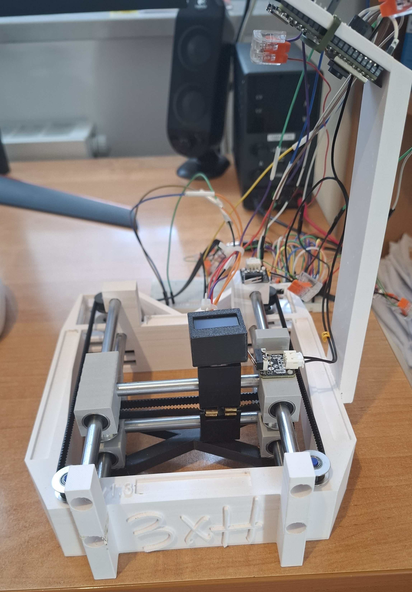

# Numkey
Functional external numerical keypad using only one keyboard switch on a H-bot kinematics.

## Features
- calibration process
- fully functional numlock
- H-bot kinematic
- sacrificial component

## How it works
An ESP32-S3 captures a photo of where your finger is, and then sends it to the connected PC via USB C. Then, a local neural network detects your finger, transforms its location on the photo to into coordinates above the device and moves the keyboard switch to the position of corresponding numpad key and updates the screen. When the ESP32 detects that the switch is pressed it sends that information to PC and a python script emulates keyboard inputs.

## Purpose
Main purpose of this project was for me to learn more about neural networks, controlling stepper motors and learning about different kinematics.

## Requirements
- Windows PC
- python 3
- arduino IDE (or other software to upload firmware to ESP32)

## How to make
### How to print:
  1. [`chassis.stl`](./models/chassis.stl) - ensure that chosen filament can withstand stepper motors temperatures, use low layer height/variable layer height, use organic supports.
  2. [`carriages.stl`](./models/carriages.stl) - use low layer height/variable layer height.
  3. [`sacrificial.stl`](./models/sacrificial.stl) - exact settings may need tuning for different printers, don't use more than 2 wall loops, use low infill (<=5%).
  4. [`rest.stl`](./models/rest.stl) - no supports.
### How to assemble:
  1. Assemble the parts as shown in [`assembly.mp4`](./assets/assembly.mp4).
  2. Install the timing belt.
  3. Upload [`ESP32_firmware.ino`](./code/ESP32_firmware.ino) to ESP32-S3.
  4. Connect all the wires accordingly to [`wiring.txt`](./assets/wiring.txt).
### How to use:
  1. Download all the files from [`code/`](./code/).
  2. Make sure that you have all of the packages listed in [`req.txt`](./req.txt).
  3. Plug the ESP32 into the PC via USB.
  4. Run [`main_code.py`](./code/main_code.py)
